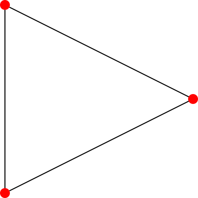
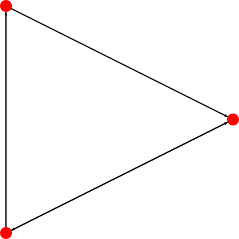
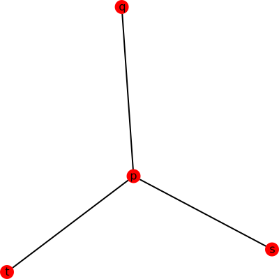
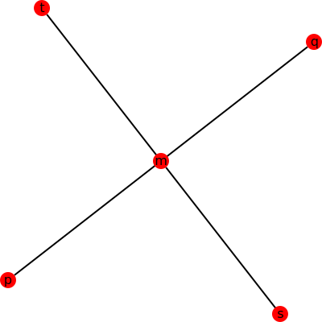
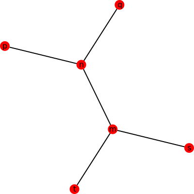

# **Graph Theory Done LEFT**

<!-- _class: lead -->

Pioooooo


## 图论简介

**图论 (Graph theory)** 是数学的一个分支，图是图论的主要研究对象

## 图论简介

**图 (Graph)** 是由若干给定的顶点及连接两顶点的边所构成的图形，这种图形通常用来描述某些事物之间的某种特定关系

顶点用于代表事物，连接两顶点的边则用于表示两个事物间具有这种关系



## 图论相关概念

<!-- _class: lead -->

## 图论相关概念

**图 (Graph)** 是一个二元组 $G=(V(G), E(G))$

其中 $V(G)$ 是非空集，称为 **点集 (Vertex set)**，对于 $V$ 中的每个元素，我们称其为 **顶点 (Vertex)** 或 **节点 (Node)** ，简称 **点**

$E(G)$ 为 $V(G)$ 各结点之间边的集合，称为 **边集 (Edge set)**


## 图论相关概念

若 $G$ 为 **无向图 (Undirected graph)**

则 $E$ 中的每个元素为一个无序二元组 $(u,v)$ ，称作 **无向边 (Undirected edge)** ，简称 **边 (Edge)** ，其中 $u,v\in V$

设 $e=(u,v)$ ，则 $u$ 和 $v$ 称为 $e$ 的 **端点 (Endpoint)**


## 图论相关概念

若 $G$ 为 **有向图 (Directed graph)**

则 $E$ 中的每一个元素为一个有序二元组 $(u,v)$ ，有时也写作 $u\to v$ ，称作 **有向边 (Directed edge)** 或 **弧 (Arc)** ，在不引起混淆的情况下也可以称作 **边 (Edge)**

设 $e=u\to v$ ，则此时 $u$ 称为 $e$ 的 **起点 (Tail)** ，称 $v$ 为 $e$ 的 **终点 (Head)** ，起点和终点也称为 $e$ 的 **端点 (Endpoint)**


## 图论相关概念

若 $G$ 为 **混合图 (Mixed graph)**

则 $E$ 中既有向边，又有无向边



## 图论相关概念

若 $G$ 的每条边 $e_k=(u_k,v_k)$ 都被赋予一个数作为该边的 **权 (Weight)** ，则称 $G$ 为 **赋权图 (Weighted Graph)**

如果这些权都是正实数，就称 $G$ 为 **正权图 (Positive Weighted Graph)**

图 $G$ 的点数 $\left|V(G)\right|$ 也被称作图 $G$ 的 **阶 (Order)**

形象地说，图是由若干点以及连接点与点的边构成的

## 图论相关概念

在无向图 $G = (V, E)$ 中，若点 $v$ 是边 $e$ 的一个端点，则称 $v$ 和 $e$ 是 **关联的 (Incident)** 或 **相邻的 (Adjacent)**

对于两顶点 $u$ 和 $v$ ，若存在边 $(u, v)$ ，则称 $u$ 和 $v$ 是 **相邻的 (Adjacent)**

## 图论相关概念

一个顶点 $v \in V$ 的 **邻域 (Neighborhood)** 是所有与之相邻的顶点所构成的集合，记作 $N(v)$

一个点集 $S$ 的邻域是所有与 $S$ 中至少一个点相邻的点所构成的集合，记作 $N(S)$ ，即：

$$
N(S) = \bigcup_{v \in S} N(v)
$$

## 图论相关概念

与一个顶点 $v$ 关联的边的条数称作该顶点的 **度 (Degree)** ，记作 $d(v)$

特别地，对于边 $(v,v)$ ，则每条这样的边要对 $d(v)$ 产生 $2$ 的贡献

## 图论相关概念

若 $d(v)=0$ ，则称 $v$ 为 **孤立点 (Isolated vertex)**

若 $d(v)=1$ ，则称 $v$ 为 **叶节点 (Leaf vertex)** / **悬挂点 (Pendant vertex)**

若 $2\mid d(v)$ ，则称 $v$ 为 **偶点 (Even vertex)**

若 $2\nmid d(v)$ ，则称 $v$ 为 **奇点 (Odd vertex)**

若 $d(v)=\left|V\right|-1$ ，则称 $v$ 为 **支配点 (Universal vertex)**

## 图论相关概念

对于无向简单图，有 $d(v) = \left|N(v)\right|$

握手定理（又称图论基本定理）：对于任何无向图 $G = (V, E)$ ，有

$$
\sum_{v\in V}d(v)=2\left|E\right|
$$

推论：在任意图中，度数为奇数的点必然有偶数个

## 图论相关概念


在有向图 $G=(V,E)$ 中，以一个顶点 $v$ 为起点的边的条数称为该顶点的 **出度 (Out-degree)** ，记作 $d^+(v)$ ，以一个顶点 $v$ 为终点的边的条数称为该节点的 **入度 (In-degree)** ，记作 $d^-(v)$

显然 $d^+(v)+d^-(v)=d(v)$

对于任何有向图 $G=(V,E)$ ，有：

$$
\sum_{v\in V}d^+(v)=\sum_{v\in V}d^-(v)=\left|E\right|
$$

## 图论相关概念

 **自环 (Loop)** ：对 $E$ 中的边 $e=(u,v)$ ，若 $u=v$ ，则 $e$ 被称作一个自环

 **重边 (Multiple edge)** ：若 $E$ 中存在两个完全相同的元素（边） $e_1,e_2$ ，则它们被称作（一组）重边

 **简单图 (Simple graph)** ：若一个图中没有自环和重边，它被称为简单图，非空简单图中一定存在度相同的结点

如果一张图中有自环或重边，则称它为 **多重图 (Multigraph)**

## 图论相关概念

**途径 (Walk)** / **链 (Chain)** ：一个点和边的交错序列，其中首尾是点—— $v_0, e_1, v_1, e_2, v_2, \ldots, e_k, v_k$ ，有时简写为 $v_0 \to v_1 \to v_2 \to \cdots \to v_k$ ，其中 $e_i$ 的两个端点分别为 $v_{i-1}$ 和 $v_i$ 。通常来说，边的数量 $k$ 被称作这条途径的 **长度** （如果边是带权的，长度通常指路径上的边权之和）

以下设 $w = \left[ v_0, e_1, v_1, e_2, v_2, \cdots, e_k, v_k \right]$

**迹 (Trail)** ：对于一条途径 $w$ ，若 $e_1, e_2, \cdots, e_k$ 两两互不相同，则称 $w$ 是一条迹

## 图论相关概念

**路径 (Path)** （又称 **简单路径 (Simple path)** )：对于一条迹 $w$ ，除了 $v_0$ 和 $v_k$ 允许相同外，其余点两两互不相同，则称 $w$ 是一条路径

**回路 (Circuit)** ：对于一个迹 $w$ ，若 $v_0 = v_k$ ，则称 $w$ 是一个回路

**环/圈 (Cycle)** （又称 **简单回路/简单环 (Simple circuit)** )：对于一条简单路径 $w$ ，若 $v_0 = v_k$ ，则称 $w$ 是一个环

## 图论相关概念

对于一张无向图 $G = (V, E)$ ，对于 $u, v \in V$ ，若存在一条途径使得 $v_0 = u, v_k = v$ ，则称 $u$ 和 $v$ 是 **连通的 (Connected)** 

由定义，任意一个顶点和自身连通，任意一条边的两个端点连通

若无向图 $G = (V, E)$ ，满足其中任意两个顶点均连通，则称 $G$ 是 **连通图 (Connected graph)** ， $G$ 的这一性质称作 **连通性 (Connectivity)**

## 图论相关概念

对于一张有向图 $G = (V, E)$ ，对于 $u, v \in V$ ，若存在一条途径使得 $v_0 = u, v_k = v$ ，则称 $u$  **可达**  $v$

由定义，任意一个顶点可达自身，任意一条边的起点可达终点

若一张有向图的节点两两互相可达，则称这张图是 **强连通的 (Strongly connected)**

若一张有向图的边替换为无向边后可以得到一张连通图，则称原来这张有向图是 **弱连通的 (Weakly connected)**

## 图的存储

<!-- _class: lead -->

## 图的存储

以下统一用 $n$ 代指图的点数，用 $m$ 代指图的边数，用 $N$ 代指图的点数的最大值，用 $M$ 代指图的边数的最大值，用 $d^+(u)$ 代指点 $u$ 的出度，即以 $u$ 为出发点的边数

## 直接存边

使用一个数组来存边，数组中的每个元素都包含一条边的起点与终点（带边权的图还包含边权）

或者使用多个数组分别存起点，终点和边权

## 直接存边

```c++
struct Edge {
    int u, v, w;
} e[M]; // pseudo

void add_edge(int u, int v, int w) {
    e[m++] = {u, v, w}; // pseudo
}

bool find_edge(int u, int v) {
    return std::find_if(e, e + m, [&](const Edge &i) -> bool {
        return i.u == u && i.v == v;
    }) != e + m;
}
```

## 直接存边

```c++
void traverse_outedges(int u, const std::function<void(int)> &foo) {
    for (int i = 0; i < m; i++) {
        if (e[i].u == u) {
            foo(e[i].v);
        }
    }
}
```

## 直接存边

```c++
std::vector<Edge> e;

void add_edge(int u, int v, int w) {
    e.push_back({u, v, w});
}

bool find_edge(int u, int v) {
    return std::find_if(e.begin(), e.end(), [&](const Edge &i) -> bool {
        return i.u == u && i.v == v;
    }) != e.end();
}
```

## 直接存边

```c++
void traverse_outedges(int u, const std::function<void(int)> &foo) {
    for (int i = 0; i < e.size(); i++) {
        if (e[i].u == u) {
            foo(e[i].v);
        }
    }
}
```

## 直接存边

**复杂度**

查询是否存在某条边： $O(m)$

遍历一个点的所有出边： $O(m)$

遍历整张图： $O(nm)$

空间复杂度： $O(m)$

## 直接存边

**应用**

Kruskal 算法

## 邻接矩阵

**Adjacency Matrix**

使用一个二维数组 `adj` 来存边，其中 `adj[u][v]` 为 1 表示存在 $u$ 到 $v$ 的边，为 0 表示不存在

如果是带边权的图，可以在 `adj[u][v]` 中存储 $u$ 到 $v$ 的边的边权

## 邻接矩阵

```c++
int adj[n][n]; // pseudo

void add_edge(int u, int v, int w) {
    adj[u][v] = w;
}

bool find_edge(int u, int v) {
    return adj[u][v];
}
```

## 邻接矩阵

```c++
void traverse_outedges(int u, std::function<void(int)> foo) {
    for (int v = 0; v < n; v++) {
        if (adj[u][v]) {
            foo(v);
        }
    }
}
```

## 邻接矩阵

**复杂度**

查询是否存在某条边： $O(1)$

遍历一个点的所有出边： $O(n)$

遍历整张图： $O(n^2)$

空间复杂度： $O(n^2)$

## 邻接矩阵

**应用**

邻接矩阵只适用于没有重边（或重边可以忽略）的情况

其最显著的优点是可以 $O(1)$ 查询一条边是否存在

由于邻接矩阵在稀疏图上效率很低（尤其是在点数较多的图上，空间无法承受），所以一般只会在稠密图上使用邻接矩阵

## 邻接表

**Adjacency List**

使用一个支持动态增加元素的数据结构构成的数组，如 `std::vector<Edge> adj[n]` 来存边，其中 `adj[u]` 存储的是点 $u$ 的所有出边的相关信息（终点、边权等）

## 邻接表

```c++
struct Edge {
    int v, w;
};

std::vector<Edge> adj[n]; // pseudo

void add_edge(int u, int v, int w) {
    adj[u].push_back({v, w});
}
```

## 邻接表

```c++
bool find_edge(int u, int v) {
    for (int i = 0; i < adj[u].size(); ++i) {
        if (adj[u][i].v == v) {
            return true;
        }
    }
    return false;
}
```

## 邻接表

```c++
void traverse_outedges(int u, const std::function<void(int)> &foo) {
    for (int i = 0; i < adj[u].size(); i++) {
        foo(adj[u][i].v);
    }
}
```

## 邻接表

**复杂度**

查询是否存在 $u$ 到 $v$ 的边： $O(d^+(u))$ （如果事先进行了排序就可以使用二分查找做到 $O(\log(d^+(u)))$ ）

遍历点 $u$ 的所有出边： $O(d^+(u))$

遍历整张图： $O(n+m)$

空间复杂度： $O(m)$

## 邻接表

**应用**

存各种图都很适合，除非有特殊需求（如需要快速查询一条边是否存在，且点数较少，可以使用邻接矩阵）

尤其适用于需要对一个点的所有出边进行排序的场合

## 链式前向星

本质上是用链表实现的邻接表

## 链式前向星

```c++
struct Edge {
    int nxt, v, w;
} e[M]; //pseudo
int head[n]; // pseudo

void add_edge(int u, int v, int w) {
    e[m] = {head[u], v, w};
    head[u] = m++;
}

int main() {
    memset(head, -1, sizeof(head));
}
```

## 链式前向星

```c++
bool find_edge(int u, int v) {
    for (int i = head[u]; ~i; i = e[i].nxt) {  // ~i 表示 i != -1
        if (e[i].v == v) {
            return true;
        }
    }
    return false;
}
```

## 链式前向星

```c++
void traverse_outedges(int u, const std::function<void(int)> &foo) {
    for (int i = head[u]; ~i; i = e[i].nxt) {
        foo(e[i].v);
    }
}
```

## 链式前向星

**复杂度**

查询是否存在 $u$ 到 $v$ 的边： $O(d^+(u))$

遍历点 $u$ 的所有出边： $O(d^+(u))$

遍历整张图： $O(n+m)$

空间复杂度： $O(m)$

## 链式前向星

**应用**

存各种图都很适合，但不能快速查询一条边是否存在，也不能方便地对一个点的出边进行排序。

优点是边是带编号的，有时会非常有用，而且如果 `cnt` 的初始值为奇数，存双向边时 `i ^ 1` 即是 `i` 的反边

## 树的概念

<!-- _class: lead gaia -->


## 树的概念

图论中的树和现实生活中的树长得一样，只不过我们习惯于处理问题的时候把树根放到上方来考虑。这种数据结构看起来像是一个倒挂的树，因此得名。

## 树的概念

一个没有固定根结点的树称为 **无根树 (Unrooted Tree)** 。无根树有几种等价的形式化定义：

* 有 $n$ 个结点， $n-1$ 条边的连通无向图
* 无向无环的连通图
* 任意两个结点之间有且仅有一条简单路径的无向图
* 任何边均为桥的连通图
* 没有环，且在任意不同两点间添加一条边之后所得图含唯一的一个环的图

## 树的概念

在无根树的基础上，指定一个结点称为 **根** ，则形成一棵 **有根树 (Rooted Tree)**

有根树在很多时候仍以无向图表示，只是规定了结点之间的上下级关系

## 有关树的定义

**适用于无根树和有根树**

* **森林 (Forest)** ：每个连通分量（连通块）都是树的图。按照定义，一棵树也是森林
* **生成树 (Spanning Tree)** ：一个连通无向图的生成子图，同时要求是树。也即在图的边集中选择 $n - 1$ 条，将所有顶点连通
* **结点的深度 (Depth)** ：到根结点的路径上的边数
* **树的高度 (Height)** ：所有结点的深度的最大值
* **无根树的叶结点 (Leaf Node)** ：度数不超过 $1$ 的结点

## 有关树的定义

**只适用于有根树**

* **父亲（Parent Node）** ：对于除根以外的每个结点，定义为从该结点到根路径上的第二个结点，根结点没有父结点
* **祖先（Ancestor）** ：一个结点到根结点的路径上，除了它本身外的结点，根结点的祖先集合为空
* **子结点（Child Node）** ：如果 $u$ 是 $v$ 的父亲，那么 $v$ 是 $u$ 的子结点。子结点的顺序一般不加以区分，二叉树是一个例外

## 有关树的定义

**只适用于有根树**

* **兄弟 (Sibling)** ：同一个父亲的多个子结点互为兄弟
* **后代 (Descendant)** ：子结点和子结点的后代。或者理解成：如果 $u$ 是 $v$ 的祖先，那么 $v$ 是 $u$ 的后代
* **子树 (Subtree)** ：删掉与父亲相连的边后，该结点所在的子图

## 有关树的定义

**特殊的树**

* **链 (Chain/Path Graph)** ：满足与任一结点相连的边不超过 $2$ 条的树称为链
* **菊花/星星(Star)** ：满足存在 $u$ 使得所有除 $u$ 以外结点均与 $u$ 相连的树称为菊花
*   **有根二叉树 (Rooted Binary Tree)** ：每个结点最多只有两个儿子（子结点）的有根树称为二叉树。常常对两个子结点的顺序加以区分，分别称之为左子结点和右子结点。大多数情况下， **二叉树** 一词均指有根二叉树。

## 有关树的定义

**特殊的树**

* **完整二叉树 (Full/Proper Binary Tree)** ：每个结点的子结点数量均为 0 或者 2 的二叉树。换言之，每个结点或者是树叶，或者左右子树均非空
* **完全二叉树 (Complete Binary Tree)** ：只有最下面两层结点的度数可以小于 2，且最下面一层的结点都集中在该层最左边的连续位置上
* **完美二叉树 (Perfect Binary Tree)** ：所有叶结点的深度均相同的二叉树称为完美二叉树。 大多数情况下， **满二叉树** 均指完美二叉树

## 树的存储

<!-- _class: lead -->

## 树的存储

**只记录父结点**

用一个数组记录每个结点的父亲结点

```c++
int parent[n];
```

这种方式可以获得的信息较少，不便于进行自顶向下的遍历

常用于自底向上的递推问题中

## 树的存储

**邻接表**

无根树：为每个结点记录所有与之相连的结点

```cpp
std::vector<int> adj[n];
```

有根树：在另一个数组中记录其父结点

```cpp
std::vector<int> children[n];
int parent[n];
```

## 树的存储

**左孩子右兄弟表示法**

给每个结点的所有子结点任意确定一个顺序

为每个结点记录两个值：其 **第一个子结点** `child` 和其 **下一个兄弟结点** `sibling` 。若没有子结点，则 `child` 为空；若该结点是其父结点的最后一个子结点，则 `sibling` 为空。

```c++
struct Node {
	int c = -1, s, w;
} tree[n];
```

## 树的存储

**左孩子右兄弟表示法**

```c++
void add_edge(int p, int c, int w) {
	tree[c].s = tree[p].c;
	tree[p].c = c;
	tree[c].w = w;
}
```

## 树的存储

**左孩子右兄弟表示法**

```c++
void traverse_outedges(int u, std::function<void(int)> foo) {
	for (int v = tree[u].c; ~v; v = tree[v].s) {
		foo(v);
	}
} // traverse children only
```

## 树的存储

**二叉树**

```c++
struct Node {
    int l, r, w;
    // -- or --
    int c[2], w;
} tree[n];
```

## DFS

<!-- _class: lead -->

## DFS

**深度优先搜索 (Depth First Search)** ，是一种用于遍历或搜索树或图的算法。所谓深度优先，就是说每次都尝试向更深的节点走。

## DFS

```c++
bool visited[n] = {false}; // pseudo

void dfs(int u) {
    if (visited[u])
        return;
    visited[u] = true;
    // do what you want here
    traverse_outedges(u, dfs);
    // or maybe here
}
```

## DFS

```c++
bool visited[n] = {false}; // pseudo

void dfs(int u) {
    visited[u] = true;
    // do what you want here
    traverse_outedges(u, [&](int v)->void{
        if (visited[v]) {
            return;
        }
        dfs(v);
    }); // lambda expression is constructed for every vertex, so the efficiency is extremely low
    // or maybe here
}
```

## DFS

**树上DFS** ：由于树是无环图，因此只需记录当前结点是由哪个结点访问而来，此后进入除该结点外的所有相邻结点，即可避免重复访问

```c++
void dfs(int u, int p) {
    traverse_children(u, [&](int v)->void{
        if (v == p) {
            return;
        }
        // do something here
        dfs(v, u);
        // or maybe here
    });
}
```

## DFS

**二叉树** 上的 **DFS**

```c++
void dfs(int r) {
    // pre-order traversal
	if (~tree[r].c[0]) {
		dfs(tree[r].c[0]);
	}
    // in-order traversal
	if (~tree[r].c[1]) {
		dfs(tree[r].c[1]);
	}
    // post-order traversal
}
```

## DFS

**复杂度**

时间复杂度为 $O(n+m)$

空间复杂度为 $O(n)$ 

栈空间复杂度为 $O(n)$

## BFS

<!-- _class: lead -->

## BFS

**宽度优先搜索 (Breadth First Search)** ，也叫广度优先搜索，是图上最基础、最重要的搜索算法之一

所谓宽度优先，就是每次都尝试访问同一层的节点，如果同一层都访问完了，再访问下一层

## BFS

这样做的结果是，BFS 算法找到的路径是从起点开始的 **最短** 合法路径，换言之，这条路所包含的边数最小

在 BFS 结束时，每个节点都是通过从起点到该点的最短路径访问的

算法过程可以看做是图上火苗传播的过程：最开始只有起点着火了，在每一时刻，有火的节点都向它相邻的所有节点传播火苗

## BFS

```c++
void bfs(int u) {
    std::queue<int> Q;
    Q.push(u);
    visited[u] = true;
    while (!Q.empty()) {
        u = Q.front();
        Q.pop();
        // do something here
        traverse_outedges(u, [&](int v) -> void {
            if (visited[v]) {
                return;
            }
            Q.push(v);
            visited[v] = true;
        }); // lambda expression is constructed for every vertex, so the efficiency is extremely low
    }
}
```

## BFS

**树** 上的 **BFS**

```c++
void bfs(int r) {
    std::queue<int> Q;
    Q.push(r);
    while (!Q.empty()) {
        r = Q.front();
        Q.pop();
        // do something here
        for (int v: adj[r])
            if (v != r) Q.push(v); // or it will overflow vertically
    }
}
```

## BFS

**复杂度**

时间复杂度 $O(n + m)$ 

空间复杂度 $O(n)$

栈空间复杂度 $O(1)$

## 树的直径

<!-- _class: lead -->

## 树的直径

**直径** ：图中所有最短路径的最大值

首先对任意一个结点做 DFS (BFS) 求出最远的结点，然后以这个结点为根结点再做 DFS 到达另一个最远结点

第一次 DFS 到达的结点可以证明一定是这个图的直径的一端，第二次 DFS 就会达到另一端

## 树的直径

引理：在一个连通无向无环图中， $x$ 、 $y$ 和 $z$ 是三个不同的结点。当 $x$ 到 $y$ 的最短路与 $y$ 到 $z$ 的最短路不重合时， $x$ 到 $z$ 的最短路就是这两条最短路的拼接

## 树的直径

定理：在一个连通无向无环图中，以任意结点出发所能到达的最远结点，一定是该图直径的端点之一

证明：设直径是 $\delta(s,t)$ ，假设从 $p$ 出发到达的最远结点为 $q\neq s,t$ ，则，

## 树的直径

* 当 $p$ 在 $\delta(s,t)$ 上时， $\delta(p,q)>\delta(p,t)$ ，此时有 $\delta(q,s)=\delta(q,p)+\delta(p,s)$。由假设 $\delta(p,q)>\delta(p,t)$ ，可得 $\delta(s,q>=\delta(s,t)$ ，假设不成立



## 树的直径

* 当 $p$ 不在 $\delta(s,t)$ 上时，
  * 当 $\delta(p,q)$ 与 $\delta(s,t)$ 有交点时，记交点为 $m$ 。此时有 $\delta(p,q)=\delta(p,m)+\delta(m,q)$ 。由假设 $\delta(p,q)>\delta(p,t)$ ，可得 $\delta(m,q)>\delta(m,t)$ ，由前一种情况的结论可知假设不成立



## 树的直径

* 当 $p$ 不在 $\delta(s,t)$ 上时，
  * 当 $\delta(p,q)$ 与 $\delta(s,t)$ 没有交点时，记 $\delta(p,t)$ 与 $\delta(s,t)$ 的第一个交点是 $m$ ， $\delta(p,t)$ 与 $\delta(p,q)$ 的最后一个交点是 $n$ 。由假设 $\delta(p,n)+\delta(n,q)>\delta(p,n)+\delta(n,m)+\delta(m,t)$ 。则 $\delta(s,q)>\delta(s,t)+2\delta(m,n)$ ，假设不成立



因此定理成立

## THX

<!-- _class: lead -->

<header>Credits: Maprit,  OI-wiki, igraph, Wikipedia, VSCode, CLion</header>

Piooooo
